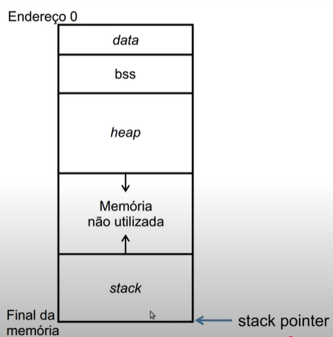
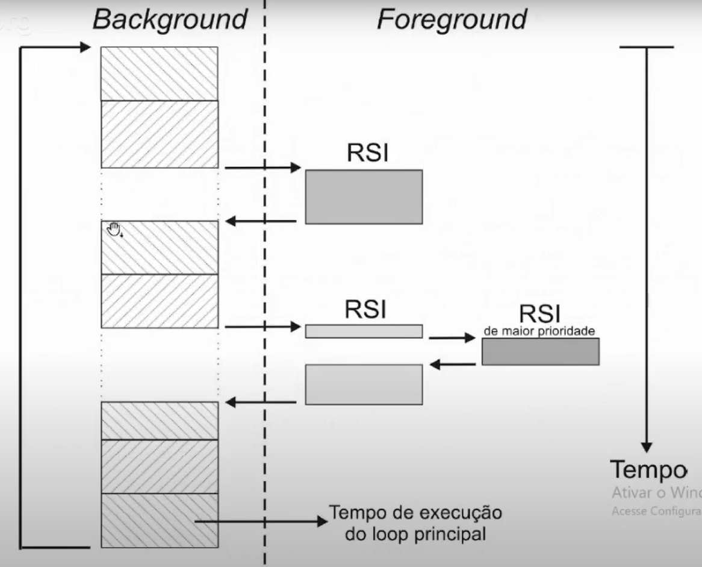
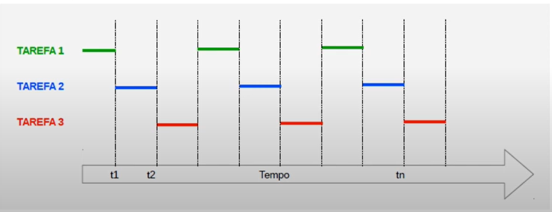
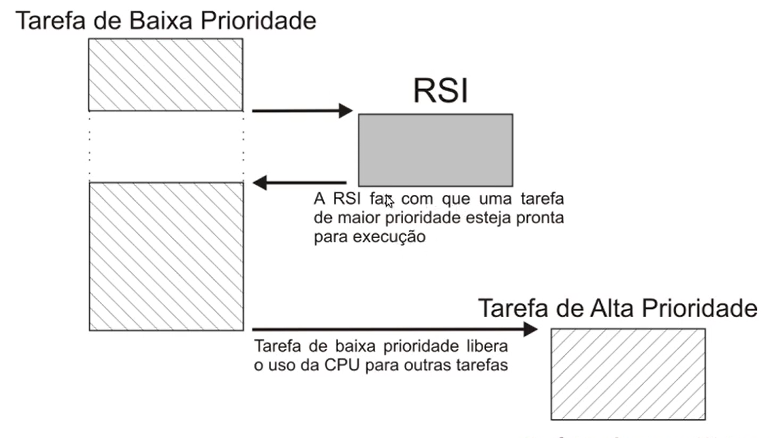
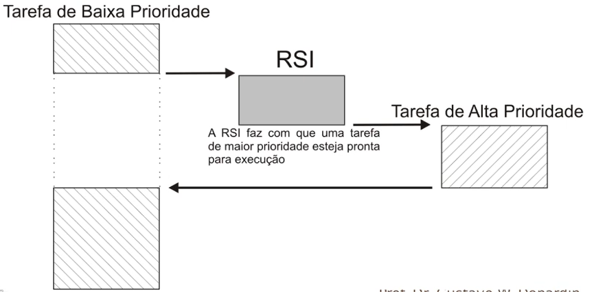
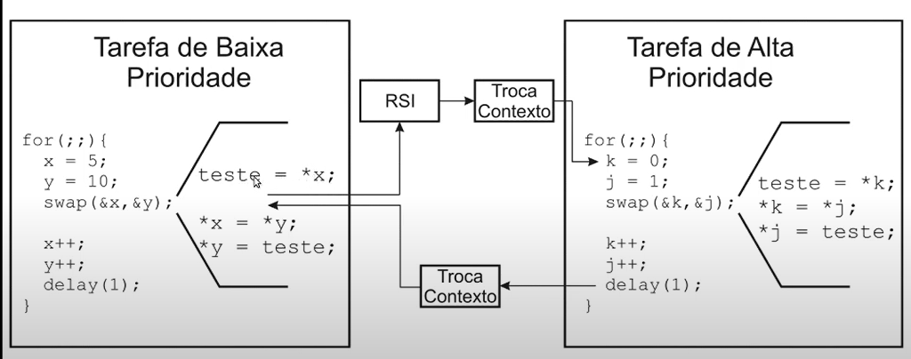

## Pilha, Ordenação e Armazenamento de Dados


<p align="center">
  
</p>

- **Data**  
  - Armazena variáveis **globais e estáticas** com **valor inicial**.  
  - Exemplo: `int x = 5;`  

- **BSS (Block Started by Symbol)**  
  - Armazena variáveis **globais e estáticas** sem valor inicial ou inicializadas com **0** por padrão.  
  - Exemplo: `int y;`  

- **Heap**  
  - Usada para **alocação dinâmica** durante a execução (`malloc`, `calloc`, `new`).  
  - O programador deve **gerenciar a memória** (liberar quando não for mais usada).  
  - Cresce **para cima**, do endereço mais baixo para o mais alto.  


### Stack


- Região da memória utilizada para armazenar dados temporários:
  - Variáveis locais
  - Parâmetros de funções
  - Valores de registradores durante chamadas de função

- Estrutura de dados com restrição, onde os elementos só podem ser adicionados ou removidos em uma única extremidade (*top*).  
- Modo de operação: **LIFO** (*Last In, First Out*).  
- Operações principais:
  - **Push** → adição de elemento  
  - **Pop** → remoção de elemento  
- **SP (Stack Pointer)** → ponteiro que indica o topo da pilha.  
- Localizada na memória RAM, normalmente ao final da memória.  
  - O **SP** aponta para o último endereço e, conforme itens são adicionados à pilha, o endereço é **decrescido**.  
- **Estouro de pilha (Stack Overflow)**  
  - Ocorre quando são empilhados mais valores do que o espaço reservado para a pilha.  
  - Isso pode causar acesso ilegal à memória, **sobrescrevendo variáveis ou ponteiros**,  
    resultando em inconsistências de funcionamento ou comportamento indefinido do sistema.  


#### Finalidades da pilha

- Guardar a posição de retorno em um salto para **interrupção**  
- Guardar a posição de retorno ao **chamar uma função**  
- Guardar o conteúdo dos **registradores** quando usados em funções e interrupções  
- **Alocar variáveis locais**  
- **Passar parâmetros** em chamadas de função  

---

### Ordenação de dados

### Endianness (Little Endian vs Big Endian)

* **Little Endian**: O **byte menos significativo (LSB)** é armazenado no endereço mais baixo.
* **Big Endian**: O **byte mais significativo (MSB)** é armazenado no endereço mais baixo.

🔹 **Por que é importante?**

* Protocolos de comunicação podem transmitir os bytes em uma ordem diferente da usada pelo processador.
* Saber o *endianness* evita erros na interpretação de dados ao enviar/receber informações entre dispositivos heterogêneos.
* o único tipo de dado que pode não dar problema, é o **char**

---

### Alinhamento de Dados

O **alinhamento** garante que variáveis sejam armazenadas em endereços múltiplos de seu tamanho natural (ex.: uma `int32` alinhada em múltiplo de 4).

* **Vantagens**: Acesso mais rápido, já que a CPU pode ler/escrever em palavras inteiras.
* **Problemas de desalinhamento**: Acesso pode ser mais lento ou até gerar *fault* em alguns processadores ARM.

🔹 **Em C/GCC** podemos controlar isso com atributos:

* `__attribute__((packed))` → Desabilita alinhamento, deixando os dados “colados” na memória.
* `__attribute__((aligned(n)))` → Garante que o dado esteja alinhado em múltiplos de *n*.

---

### Exemplos

```c
// Estrutura com alinhamento natural
struct exemplo1 {
    char a;     // 1 byte
    int b;      // 4 bytes (provavelmente alinhado em múltiplo de 4)
};

// Estrutura "packed" (sem alinhamento)
struct exemplo2 {
    char a;
    int b;
} __attribute__((packed));

// Estrutura alinhada a 2 bytes
struct exemplo3 {
    char a;
    int b;
} __attribute__((aligned(2)));
```

* **exemplo1** pode ocupar 8 bytes devido ao *padding* automático.
* **exemplo2** ocupa 5 bytes, mas pode ser mais lento de acessar.
* **exemplo3** força alinhamento de 2 bytes, útil em protocolos ou mapeamento de hardware.

--- 

## Memórias em Sistemas Embarcados

### SDRAM e SRAM

- **SRAM - Static Random Access Memory**
  - Memória volátil
  - Não necessita de refresh
  - Cada célula de armazenamento de um bit é implementada com um circuito de 6 transistores
  - Mantém o valor enquanto houver energia
  - Relativamente insensível a distúrbios, como ruídos elétricos
  - Mais rápida, porém de maior custo que memórias do tipo DRAM
  - Custo de energia menor e estável

- **SDRAM - Synchronous Dynamic Random Access Memory**
  - Cada célula armazena um bit com um transistor e um capacitor
  - Os valores devem ser recarregados periodicamente (refresh a cada 10–100 ms)
  - Sensível a distúrbios
  - Mais lenta e mais barata que as memórias SRAM
  - Aumento de consumo conforme a temperatura
  - Pode gerar falhas de segurança devido à sensibilidade a interferências

> O ideal, devido às suas vantagens, é a utilização de **SRAM** em sistemas; no entanto, seu alto custo torna inviável o uso em muitos projetos. Por isso, sistemas menos críticos frequentemente utilizam **SDRAM**, que apresenta maior capacidade e menor custo, mesmo com desempenho inferior à SRAM.

### Memória Flash

- Memórias do tipo **não volátil**
- Mantêm os dados mesmo na ausência de energia
- Utilizadas para armazenamento permanente, como firmware, sistemas embarcados e dispositivos USB
- Mais lenta que SRAM e SDRAM em leitura e escrita
- Não requer refresh, mas possuem ciclo limitado de gravação/apagamento

#### Assincronia entre processador e Flash

A Flash possui **menor desempenho e é menos eficiente que a RAM**

Quando a frequência do processador é maior que a da memória Flash, ocorre uma **assincronia entre eles**, o que compromete o desempenho do processador, que precisa aguardar a memória responder às operações de leitura ou escrita.  

Para mitigar esse problema, normalmente são utilizados três métodos:

* **Inserir wait-cycles durante o acesso à Flash**  
  - **Vantagens:**  
    - Solução de baixo custo  
    - Simples de implementar  
  - **Desvantagens:**  
    - Ainda há perda de desempenho devido à diferença de velocidade entre processador e memória  
    - Não melhora a eficiência em operações intensivas de leitura/escrita  

* **Uso de cache**  
  - **Vantagens:**  
    - Reduz significativamente o número de acessos à memória lenta  
    - Melhora consideravelmente o desempenho do processador  
  - **Desvantagens:**  
    - Aumenta a complexidade do hardware  
    - Consome mais área de memória (SRAM)  
    - Pode gerar inconsistência se o cache não for corretamente gerenciado  
    - Possui comportamento não determinístico, principalmente em aplicações de tempo real

* **Prefetching ou buffers**  
  - **Vantagens:**  
    - Permite que o processador continue executando sem esperar pela memória lenta  
    - Aumenta o throughput em leitura sequencial de dados  
  - **Desvantagens:**  
    - Implementação mais complexa  
    - Eficaz principalmente para padrões de acesso previsíveis  
    - Pode desperdiçar energia e memória se dados pré-carregados não forem utilizados

* **Copiar código da FLASH para a RAM**  
  - **Vantagens:**  
    - Desempenho máximo do sistemas  
  - **Desvantagens:**  
    - Solução de alto custo

#### Modo de aceleração de memória

Outra maneira de melhorar o desempenho é utilizar o **modo de aceleração de memória**, no qual o **barramento da memória Flash é aumentado**.  
Isso permite que o processador acesse a memória mais rapidamente, reduzindo a latência de leitura e melhorando a eficiência geral do sistema.  

- **Vantagens:**  
  - Reduz o tempo de espera do processador  
  - Melhora o desempenho em comparação ao acesso normal à Flash  

- **Desvantagens:**  
  - Pode aumentar o consumo de energia  
  - Nem todos os dispositivos suportam esse modo  
  - Limites físicos da memória podem restringir o ganho de desempenho

### EEPROM (Electrically Erasable Programmable Read-Only Memory)

- **Vantagens:**  
  - Não volátil, mantém os dados mesmo sem energia  
  - Permite regravação elétrica sem remover o chip  

- **Desvantagens:**  
  - Velocidade de escrita e leitura baixa  
  - Número limitado de ciclos de escrita (baixa durabilidade)  

---

### FlexMemory

- **Descrição:**  
  - Opção alternativa à EEPROM, geralmente combinando memória Flash e RAM  
  - Pode ser usada para armazenamento não volátil com maior flexibilidade  

- **Vantagens:**  
  - Maior capacidade de armazenamento comparado à EEPROM  
  - Possibilidade de leitura/escrita mais rápida  

- **Desvantagens:**  
  - Mais complexa e geralmente mais cara  
  - Requer controle adicional para gerenciar a parte volátil e não volátil


---

## FSM com switch-case

### Projeto de Software

O projeto de software pode ser organizado seguindo um **modelo em camadas**, que separa responsabilidades e facilita a manutenção:

1. **Camada de Aplicação**  
   - Implementa a lógica principal do sistema (regras de negócio).  
   - Define os estados e transições da FSM utilizando `switch-case`.  
   - Interage apenas com a camada de sistema, sem depender diretamente do hardware.  

2. **Camada de Sistema**  
   - Fornece serviços básicos para a aplicação, como temporização, filas, comunicação e gerenciamento de eventos.  
   - Faz a ponte entre a aplicação e o hardware.  
   - Encapsula detalhes de baixo nível, permitindo que a FSM seja mais portátil.  

3. **Camada de Abstração de Hardware (HAL - Hardware Abstraction Layer)**  
   - Contém drivers e rotinas de baixo nível para acesso ao hardware (GPIO, UART, SPI, ADC, etc.).  
   - Fornece interfaces padronizadas que a camada de sistema utiliza.  
   - Permite que o mesmo software funcione em diferentes plataformas com mudanças mínimas.  


### Máquinas de Estados Finitos (FSM)

As **Máquinas de Estados Finitos (Finite State Machines — FSM)** constituem uma técnica mais organizada para projetar o software de um sistema embarcado.  
Nela, o sistema é modelado em **estados bem definidos**, onde cada estado representa uma condição ou modo de operação específico.  

- Em cada estado, o sistema executa apenas a **tarefa associada** àquele estado.  
- A transição entre estados ocorre de acordo com **eventos ou condições pré-definidas** (ex.: interrupções, entrada de dados, temporizadores).  
- Essa abordagem torna o software **mais estruturado, legível e de fácil manutenção**, além de facilitar a depuração e a expansão do sistema.  

Exemplo: 

```c
int main(void){
    char slot;
    while(1){
        switch(slot){
            case 0:
                LeTeclado(); slot = 1; break;
            case 1: 
                AtualizaDisplay(); slot = 2; break;
            case 2: 
                RecebeSerial(); slot = 3; break;
            case 3: 
                AtualizaDisplay(); slot = 4; break;
            case 4:
                EnviaSerial(); slot = 5; break;
            case 5:
                AtualizaDisplay(); slot = 2; break;
            default: 
                slot = 0; break;
        }
    }
}
```

---
## Programação Concorrente - Sistemas de Tempo Real

### Sistemas de Tempo Real
- São sistemas que trabalham sob **restrições temporais**.  
- Não estão relacionados diretamente à **velocidade**, mas sim à **previsibilidade**, dependendo do contexto e da aplicação.  

- **Soft real-time**  
  - Sistemas que podem continuar funcionando corretamente mesmo que algumas restrições de tempo não sejam respeitadas.  
  - Exemplos: sistema de aquisição de dados, player de áudio, vidro elétrico de um carro.  

- **Hard real-time**  
  - Sistemas que **devem cumprir rigorosamente as restrições temporais**, sob risco de consequências graves ou catastróficas.  
  - Normalmente estão relacionados à **segurança e à vida humana**.  
  - Exemplos: sistemas de controle de um avião, freio ABS, controle de mísseis.  

- A maioria dos sistemas de tempo real existentes utiliza uma **combinação de requisitos Soft e Hard**.  


### Background e Foreground

<p align="center">
  
</p>

Em sistemas embarcados simples, a execução do software geralmente segue o modelo **background/foreground**.

- **Background**  
  - Corresponde a um **laço infinito** (main loop) que executa continuamente.  
  - Esse laço chama módulos ou funções responsáveis por realizar as operações desejadas, como leitura de sensores, atualização de variáveis ou envio de dados.  
  - É considerado processamento **não prioritário**, pois roda apenas quando não há tarefas mais urgentes.  

- **Foreground**  
  - Corresponde às **interrupções** ou rotinas que interrompem o fluxo normal do programa para tratar eventos assíncronos (ex.: temporizadores, recepção de dados via UART, acionamento de botão).  
  - É considerado processamento **prioritário**, pois ocorre de forma assíncrona e deve ser atendido rapidamente.  

* Nesse tipo de sistema, operações críticas devem ser executadas pelas **interrupções**, de modo a garantir os requisitos de tempo.  
  - As informações disponibilizadas nas interrupções podem ser processadas **na própria interrupção** ou posteriormente no **background**.  
  - Quando processadas no background, o tempo até que essas informações sejam tratadas é chamado de **Tempo de Resposta da Tarefa**.  

* O pior caso de tempo de resposta de uma tarefa depende do tempo de execução do **laço de background**.  
* **O tempo de execução de um sistema background/foreground não é determinístico**

#### Vantagens
- Fácil e rápido de desenvolver
- Não requer treinamento ou conhecimento de APIs específicas de um sistema operacional
- Não consome recursos adicionais comparado à soluções que utilizam sistemas operacionais
- **Solução ótima em projetos pequenos e com requisitos modestos de restrições de tempo**

#### Desvantagens
- Difícil garantir que uma operação será executada dentro das restrições de tempo
- Todo código em background tem a mesma prioridade
- Todo o sistema sofrerá o impacto se uma das funções demorar mais que o esperado
- Dificuldade de coordenar o código quando mantido por múltiplos desenvolvedores

### Tipos de Eventos

- **Evento síncrono**  
  - São previsíveis.  
  - Ocorrem como resultado direto da execução do programa corrente.  

- **Evento assíncrono**  
  - São imprevisíveis e podem ocorrer várias vezes durante a execução.  
  - Não estão diretamente relacionados às instruções do programa.  
  - As **interrupções** são exemplos típicos de eventos assíncronos.  

### Sistemas Operacionais  

Um sistema operacional em sistemas embarcados pode ser analisado a partir de duas perspectivas:  

#### Abordagem Top-Down  
- Vista pela perspectiva do **usuário ou projetista**.  
- Fornece **abstração do hardware**, funcionando como intermediário entre os aplicativos e os dispositivos físicos.  
- Facilita o desenvolvimento de software, escondendo a complexidade do hardware subjacente.  

#### Abordagem Bottom-Up  
- Vista pela perspectiva **interna do sistema**.  
- Atua como um **gerenciador de recursos**, controlando:  
  - Quais tarefas podem ser executadas.  
  - Quando cada tarefa será executada.  
  - Quais recursos (CPU, memória, periféricos) cada tarefa pode utilizar.  
- Foca na **organização e eficiência** do uso dos recursos disponíveis.  

De modo geral, pode-se dizer que um sistema operacional possui as funções de: 
* Gerenciamento de tempo e recursos de CPU
* Gerenciamento de tarefas
* Gerenciamento de memória
* Gerenciamento de periféricos
* Prover funcionalidades: sistema de arquivos, protocolos de rede, etc.

### Sistema Operacional de Tempo Real (RTOS)

- Possui recursos para garantir o **determinismo**, ou seja, previsibilidade no tempo de execução.  
- O núcleo (**kernel**) de um RTOS inclui gerenciamento de:  
  - **Memória**  
  - **Tempo** (temporizadores, escalonamento)  
  - **Tarefas** (criação, suspensão, exclusão, escalonamento)  
  - **Recursos** (semáforos, mutex, filas de mensagens)  
- Cabe ao **desenvolvedor** dividir o sistema em tarefas e atribuir **prioridades** de acordo com os requisitos do projeto.  
- O RTOS atua como um **multiplexador do processador**, realizando o **chaveamento** ou **troca de contexto** entre tarefas conforme a política de escalonamento definida.  

<p align="center">
  
</p>

#### Desvantagens
* O núcleo de um RTOS adiciona overhead ao sistema devido a vários motivos:
  - Troca de contexto: Custo computacional para passar a CPU de uma tarefa para outra
  - Ocupar espaço de código para implementar sesu serviços
  - Ocupar espaço em RAM para a manutenção de suas estruturas de dados
  - Tipicamente o SO ocupa de 1% a 5% da CPU

### Núcleo Cooperativo

- Núcleos cooperativos requerem que cada tarefa **explicitamente desista do controle da CPU**.  
- Os **eventos assíncronos** continuam a ser tratados por **rotinas de interrupção**.  
- Uma interrupção pode fazer com que uma tarefa de maior prioridade saia do estado de **bloqueio** e entre na lista de **tarefas prontas para execução**.  
- A tarefa de maior prioridade **somente ganhará o controle da CPU quando a tarefa em execução desistir do processamento**.  

<p align="center">
  
</p>

#### Vantagens
- Baixa latência nas interrupções.  
- Permite a utilização de **funções não reentrantes**.  
- O tempo de resposta das tarefas é limitado pelo **maior tempo de liberação da CPU** de uma tarefa (melhor desempenho em relação ao *super-loop*).  
- Menor preocupação com **recursos compartilhados**,  
  - embora a **exclusão mútua** ainda seja necessária para dispositivos de entrada/saída.  
- Em relação ao *super-loop*:  
  - As tarefas podem desistir da CPU várias vezes antes de completarem sua execução.  
  - O tempo de resposta não depende de todo o laço, mas apenas do tempo da maior tarefa.  

#### Desvantagens
- **Tempo de resposta**: uma tarefa de maior prioridade pronta para execução pode ter que esperar até que a tarefa atual libere a CPU.  
  - Apesar disso, ainda é previsível, podendo ser **determinístico**. 

### Núcleo Preemptivo
* Um núcleo preemptivo é utilizado quando a resposta do sistema a um determinado evento é importante
* O controle da CPU é sempre dado a tarefa de maior prioridade pronta para execução no menor tempo possível
* O tempo de execução das tarefas de maior prioridade é determinístico


A preempção (suspensão) pode ser desencadeada por uma tarefa ou por uma interrupção
<p align="center">
  
</p>

#### Função não-reentrante e os núcleos preemptivos
* Uma função reentrante é uma função que pode ser utilizada por mais de uma tarefa sem a possibilidade de danificar dados 

```c
void strcpy(char *dest, char *src)
{
  while(*src)
  {
    *dest++ = *src++;
  }
}
```

#### Função não reentrante com variável global
```c
int teste;
void swap(int *x, int *y)
{
  teste = *x;
  *x = *y;
  *y = teste;
}
```

* A função não reentrante não protejida pode gerar problema em núcleos preemptivos
  - Exemplos:
    - malloc() e free()
* Em núcleos preemptivos, a CPU pode ser interrompida a qualquer momento para executar uma tarefa de maior prioridade.

* Isso torna muito mais provável que funções não reentrantes sejam interrompidas no meio da execução, causando inconsistências.

<p align="center">
  
</p>

--- 

### Protothreads

* Programação em threads mas que funcionam como FSM
* Continuação local
  -   Continuação da função a partir de um ponto de saída

#### Macros para continuação local com switch-case
```c
  struct pt {
    unsigned short lc;
  };

  #define PT_INIT(pt) (pt)->lc =0;

  #define PT_BEGIN(pt) switch(pt->lc) { case 0:

  #define PT_WAIT_UNTIL(pt, c) (pt)->lc = __LINE__; case __LINE__: \
                                if(!(c)) return 1

  #define PT_EXIT(pt) (pt)->lc=0; return 0

  #define PT_END(pt) } (pt)->lc=0; return 0

  // MODELO DE PROTOTHREAD

  int a_protothread(struct pt *pt){
    PT_BEGIN(pt);

    PT_WAIT_UNTIL(pt, condition1); //⟲⟲

    if(something){
      PT_WAIT_UNTIL(pt, condition2); //⟲⟲⟲⟲
    }

    PT_END()
  }


  // EQUIVALENTE A 

  int a_protothread(struct pt *pt){
    switch(pt->lc) {
      case 0:
    pt->lc = 5; case 5:
        if(!(condition1)) return 0;

        if(something){
          pt->lc = 10; case 10:
          if(!(condition2)) return 0;
        }
    } return 1;
  }
```

### Limitações das Protothreads

#### Uso de `switch/case`
- Como a implementação de protothreads é baseada em `switch/case` e números de linha (`__LINE__`), o uso explícito de `switch/case` dentro de uma protothread pode conflitar com a lógica de controle, gerando comportamento incorreto.  
- Por isso, **não é recomendável utilizar `switch/case` diretamente dentro do corpo de uma protothread**.

#### API das protothreads em funções chamadas
- Sim, é possível utilizar macros da API dentro de funções chamadas por uma protothread, desde que a função também receba um ponteiro para a estrutura `struct pt`.  
- Isso permite a criação de **protothreads aninhadas**, onde cada função mantém seu próprio estado de continuação.

#### Variáveis com `static`
- Como não há pilha dedicada para cada protothread, as variáveis locais normais são perdidas a cada retorno da função.  
- Por isso, todas as variáveis que precisam persistir entre chamadas devem ser declaradas como `static`, garantindo sua retenção entre execuções.

---

### Vantagens das Protothreads

#### Uso de uma única pilha
- Reduz drasticamente o consumo de memória em sistemas embarcados com recursos limitados.

#### Programação estruturada
- O código das protothreads se parece com código sequencial tradicional, facilitando a leitura e manutenção.

#### Simplicidade
- Permitem implementar concorrência cooperativa sem necessidade de um escalonador complexo.

#### Baixa sobrecarga
- Não há necessidade de salvar/restaurar o contexto completo de registradores, como ocorre em threads reais.

---

### Desvantagens

#### Não são preemptivas
- A protothread só avança quando chamada explicitamente, o que significa que uma função bloqueante pode travar todo o sistema.

#### Restrições de linguagem
- Não é possível usar `switch/case` livremente.  
- Variáveis locais comuns não são preservadas.  
- Pilha não é isolada por protothread.  

#### Menor flexibilidade
- Não suportam paralelismo real, apenas **concorrência cooperativa**.

--- 

## Variáveis `volatile` e `static` no contexto de sistemas embarcados

### Onde variáveis são alocadas na memória

- **Variáveis globais/static não inicializadas**  
  - Vão para a **seção `.bss`**.  
  - São **inicializadas automaticamente com valor 0** durante o startup do sistema (antes do `main`).  

- **Variáveis globais/static inicializadas**  
  - Vão para a **seção `.data`**.  
  - Os valores iniciais são armazenados na Flash (ROM) e copiados para a RAM na inicialização.  

- **Variáveis locais (automáticas)**  
  - Vão para a **pilha (stack)**.  
  - São criadas quando a função é chamada e destruídas ao sair da função.  
  - Não possuem valor inicial definido (contêm lixo de memória se não forem explicitamente inicializadas).  

---

### `volatile`
- Indica ao compilador que o valor da variável **pode mudar de forma assíncrona** (por hardware, ISR, registradores de periféricos).  
- Evita otimizações que poderiam remover leituras/escritas “aparentemente redundantes”.  
- Muito usado em variáveis acessadas por **interrupções** ou **endereços de registradores mapeados em memória**.

### `static`
- Quando aplicado a variáveis locais, faz com que:  
  - Elas sejam alocadas em memória estática (em `.bss` ou `.data`), **não na pilha**.  
  - **Persistam entre chamadas da função**, mantendo o valor anterior.  
- Quando aplicado a variáveis globais, restringe o **escopo de visibilidade** ao arquivo onde foram declaradas (internal linkage).  
---

## Inicialização de Memória e Execução até `main()` em Sistemas Embarcados

1. **Como o programa chega até a `main()`?**  
   - Após o **reset** do microcontrolador, o processador busca o endereço inicial na **vetor de interrupções** (em Flash).  
   - O primeiro endereço do vetor aponta para o valor inicial da **pilha (stack pointer)**.  
   - O segundo endereço aponta para a **rotina de Reset** (Reset Handler).  
   - O **Reset Handler** não vai direto para `main()`: antes ele executa a rotina de **startup** (normalmente escrita em assembly ou C), que prepara todo o ambiente de execução.  
   - Só depois dessa preparação o controle é transferido para a função `main()`.

---

2. **Como as variáveis são inicializadas?**  
   O código de **startup** faz a inicialização da memória antes de chamar `main()`:
   - **Seção `.data`** (variáveis globais/static inicializadas):  
     - Os valores iniciais estão gravados em **Flash**.  
     - Durante o startup, esses valores são **copiados para a RAM**, onde as variáveis de fato residirão durante a execução.  
   - **Seção `.bss`** (variáveis globais/static não inicializadas ou explicitamente inicializadas com `0`):  
     - Essa região é **zerada pelo startup** (todas as variáveis começam com 0).  
   - **Variáveis locais (automáticas)**:  
     - Criadas na **pilha (stack)** no momento da chamada da função.  
     - **Não possuem valor inicial definido** (lixo de memória) caso não sejam explicitamente inicializadas pelo programador.

---

3. **Resumo da ordem de execução após o Reset**
   1. Hardware inicializa o **stack pointer**.  
   2. PC (Program Counter) é carregado com o endereço do **Reset Handler**.  
   3. O **Reset Handler/startup**:
      - Copia `.data` da Flash para a RAM.  
      - Zera `.bss`.  
      - Inicializa periféricos básicos (dependendo da implementação).  
   4. Chama a função `main()`.  
   5. Execução do programa do usuário começa.  

